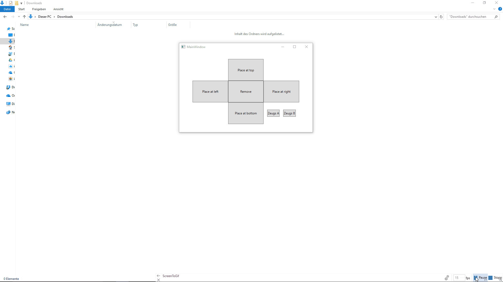

# **AppBarServices**
_**Careful, this is still under construction!**_

## **General**
AppBarServices is a .NET class library written in C# whose intended use is to provide AppBarServices (such as registering and positioning an AppBar) to a WPF application.

Given that it is a .NET class library and does utilize multiple functions of the Windows Api, this library can only be used for applications targeting the Windows operating system.

## **Objective of this Repository**
There are at least two projects here on GitHub and elsewhere that provide a similar functionality (check them out!):
* [WPFAppBar](https://github.com/PhilipRieck/WpfAppBar)
* [SidebarDiagnostics](https://github.com/ArcadeRenegade/SidebarDiagnostics/blob/master/SidebarDiagnostics/Windows.cs)
* [Google-Desktop-like AppBar](https://www.codeproject.com/Articles/232972/Creating-an-application-like-Google-Desktop-in-WPF)

So why did I decide to implement my own service? Here are some bullet points to clarify what the repository wants to be and how it might distinguish itself from other repositories:
* **Completness:** The repo aims to provide an AppBarService that works for always visible, as well as autohide AppBars and should not display buggy behavior in multi monitor setups, even if the setup changes while the AppBar is active (e.g. one monitor changing its resolution or getting shut off).
* **Accessibility:** This point has two sides to it. One, the class library should be easy to integrate into a WPF application by only reading the documentation provided here and using Intellisense and without looking at the actual implementation of the library. Two, if one wants to understand how things work under the hood the design of the code and the documentation within it (i.e. comments) should be as easy to follow as possible.
* **Autonomy:** The library should do one thing and one thing only: provide the services necessary to implement a WPF AppBar application. The only exception to this guideline is a WPF project that showcases the functionality and therefore benefits understanding.
* **WPF Only:** What the library does it should do using WPF libraries only. The exception to this rule are WinApi function calls where no WPF implementation exists or where it is not suitable. What I want to stress with this point is that no WinForms facilities are used in this library.
* **Learning Effect:** I am a beginner programmer and especially new to C#, .NET and WPF. Building an AppBar from scratch (well... not really considering how many libraries and frameworks one uses to build software) helps me understand all of this a little better. This also means that I highly appreciate any feedback. Be it suggestions as to how to refactor some code parts, clarifications regarding code comments that display a wrong understanding or simply grammar/spelling mistakes - I'm here to learn so please get in touch!

## **Prerequisites**
_to be added_

## **How to use it**
_to be added_

## **Architecture of the library**
_to be added_

## **Useful Links**
* [Using Application Desktop Toolbars](https://msdn.microsoft.com/en-us/library/windows/desktop/cc144177%28v=vs.85%29.aspx)
* [SHAppBarMessage Function](https://msdn.microsoft.com/en-us/library/windows/desktop/bb762108(v=vs.85).aspx)
* [APPBARDATA Structure](https://msdn.microsoft.com/en-us/library/windows/desktop/bb773184(v=vs.85).aspx)
* [RegisterWindowMessage Function](https://msdn.microsoft.com/en-us/library/windows/desktop/ms644947(v=vs.85).aspx)
* [Window Messages Article](https://msdn.microsoft.com/en-us/library/windows/desktop/ff381405(v=vs.85).aspx)
* [WPF Windows and their Win32 Handle](http://www.abhisheksur.com/2010/12/win32-handle-hwnd-wpf-objects-note.html)
* [Attaching to WndProc in WPF](http://blog.andreweichacker.com/2010/02/attaching-to-wndproc-in-wpf/)
* [GetMonitorInfo Function](https://msdn.microsoft.com/de-de/library/windows/desktop/dd144901(v=vs.85).aspx)
* [MonitorFromRect Function](https://msdn.microsoft.com/de-de/library/windows/desktop/dd145063(v=vs.85).aspx)
* [Microsoft AppBar Example](https://github.com/Microsoft/Windows-classic-samples/tree/master/Samples/Win7Samples/winui/shell/legacysamples/appbar)